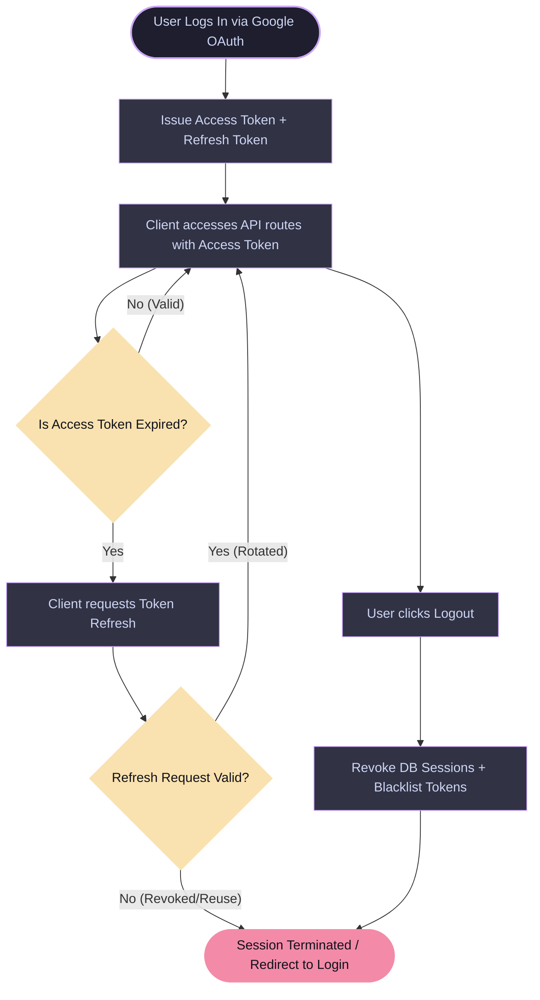
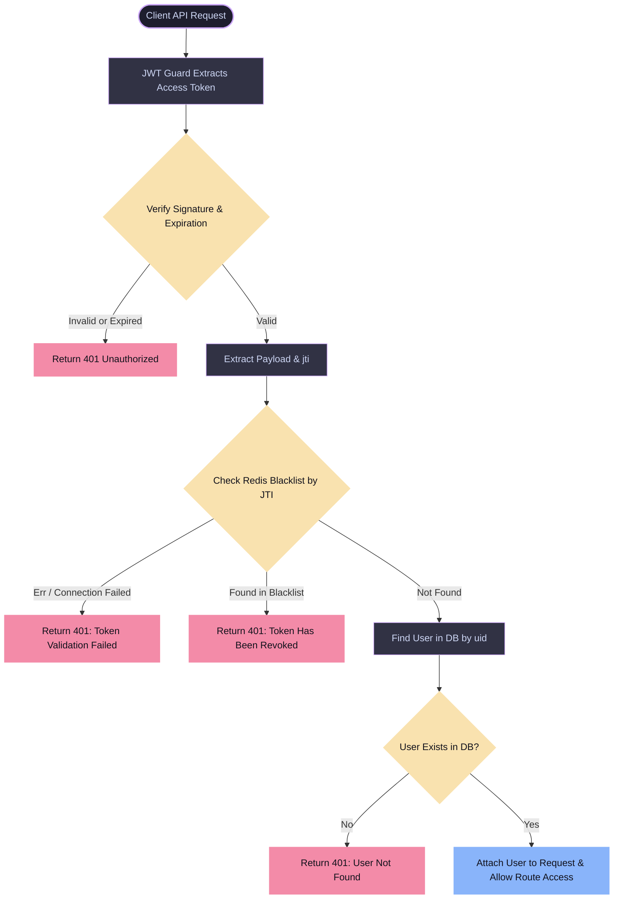
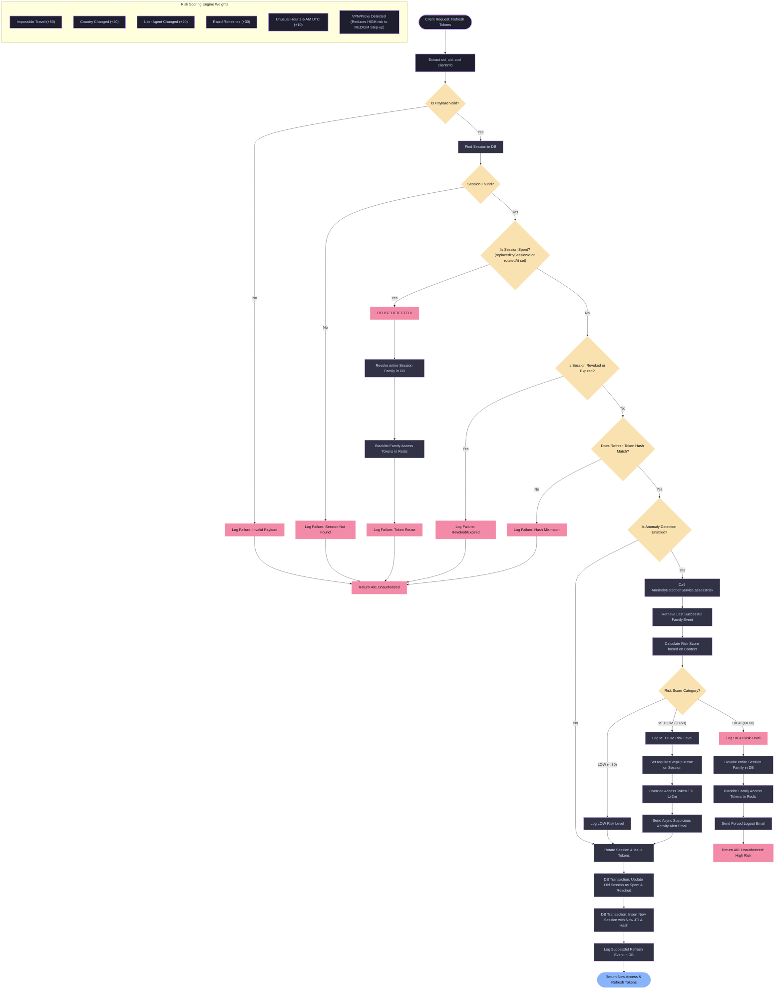
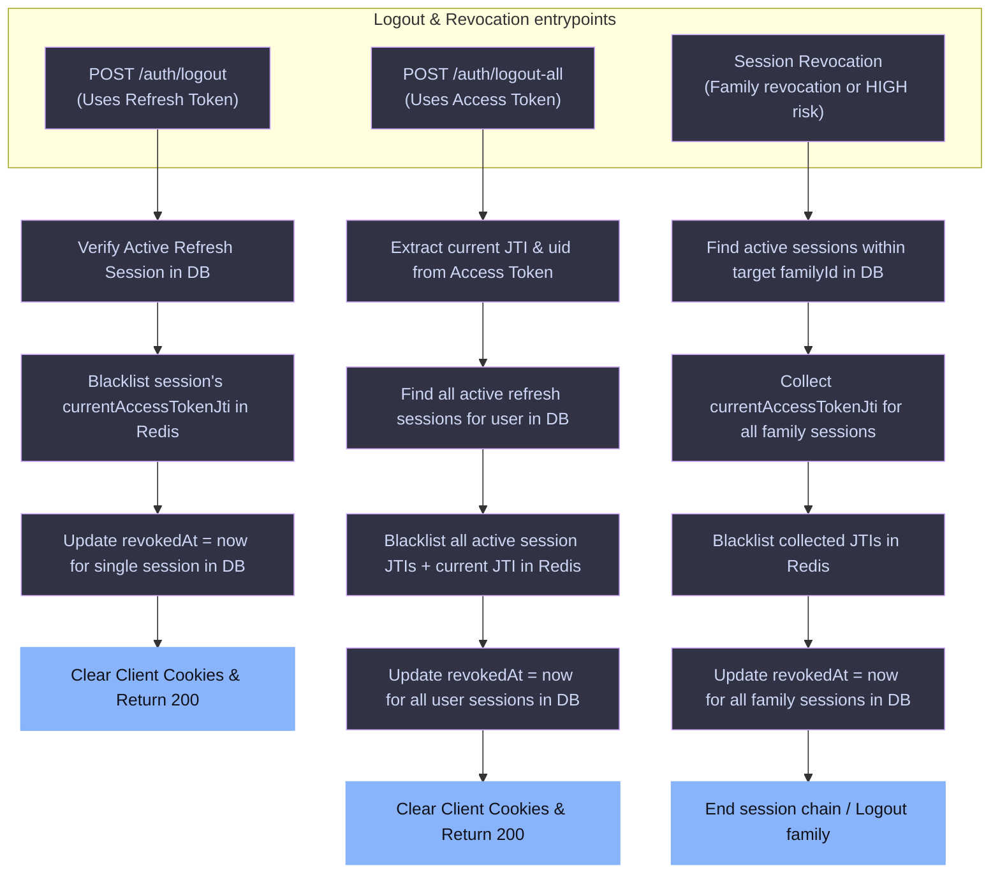
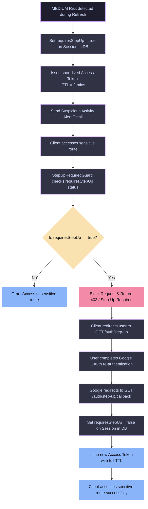

# Breeze Authentication & Security Flow Diagrams

This document contains high-fidelity visual representations of the core authentication, session management, token blacklisting, and anomaly detection flows implemented in **Breeze**. 

These diagrams are written using [Mermaid.js](https://mermaid.js.org/) syntax, which renders natively in modern markdown viewers (such as GitHub, VS Code, and GitLab).

---

## Table of Contents
1. [Core Token Lifecycle Overview](#1-core-token-lifecycle-overview)
2. [Token Verification & Access Blacklist Guard](#2-token-verification--access-blacklist-guard)
3. [Token Refresh Flow & Dynamic Anomaly Detection](#3-token-refresh-flow--dynamic-anomaly-detection)
4. [Session Logout & Revocation Channels](#4-session-logout--revocation-channels)
5. [Step-Up Authentication Flow](#5-step-up-authentication-flow)

---

## 1. Core Token Lifecycle Overview

This high-level overview shows how a client initiates a session via Google OAuth, maintains it via short-lived access tokens and token rotation, and eventually terminates the session safely.

---

## 2. Token Verification & Access Blacklist Guard

Every time a client makes a request to a route protected by the `JwtAuthGuard`, the backend validates the signature, check if it's expired, and then checks the global **Redis Blacklist** by its `jti` (JWT ID). This gives stateless JWTs immediate, stateful revocability on demand.

---

## 3. Token Refresh Flow & Dynamic Anomaly Detection

This flowchart outlines the token refresh process (`AuthService.refreshTokens`), where the system performs validation checks, reuse detection, and computes the risk score of the current request if **Anomaly Detection** is enabled.

---

## 4. Session Logout & Revocation Channels

There are three key revocation mechanisms designed to destroy active sessions. All paths handle DB updates (marking session rows with a `revokedAt` timestamp) and Redis blacklisting (using access token `jti` values to guarantee instant rejection by the `JwtStrategy`).

---

## 5. Step-Up Authentication Flow

If a refresh request triggers **MEDIUM** risk (`30-59` score), the user gets a short-lived access token (default 2 minutes) and has their session marked with `requiresStepUp = true`. When accessing sensitive APIs, they must re-verify their identity via Google OAuth to clear this requirement.

